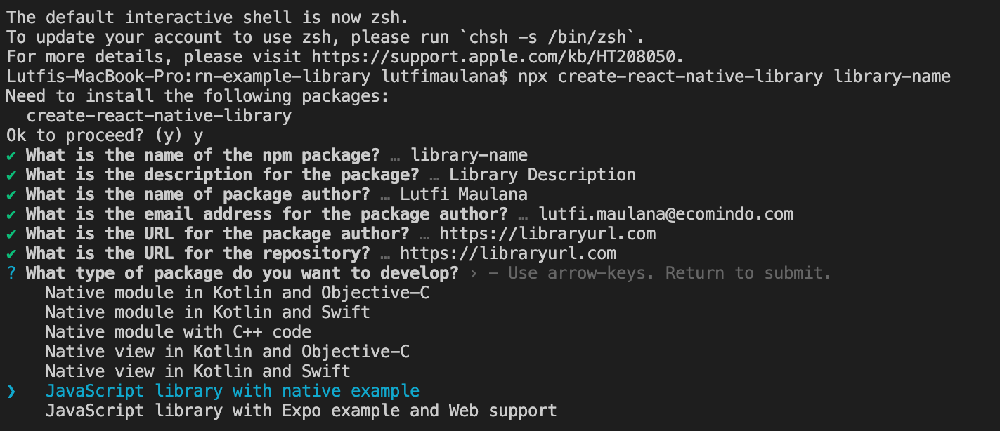

# react-native-package

# How to create react native package (Azure DevOps)



```sh
1. npx create-react-native-library library-name
2. change devDependencies value to this:
   {
      "@babel/core": "^7.12.10",
      "@babel/runtime": "^7.12.5",
      "@commitlint/config-conventional": "^11.0.0",
      "@react-native-community/async-storage": "^1.7.1",
      "@react-native-community/eslint-config": "^2.0.0",
      "@release-it/conventional-changelog": "^2.0.0",
      "@types/jest": "^26.0.0",
      "@types/react": "^16.9.19",
      "@types/react-native": "0.62.13",
      "@types/react-test-renderer": "^16.9.2",
      "babel-jest": "^25.1.0",
      "babel-plugin-module-resolver": "^4.0.0",
      "commitlint": "^11.0.0",
      "eslint": "^7.2.0",
      "eslint-config-prettier": "^7.0.0",
      "eslint-plugin-prettier": "^3.1.3",
      "jest": "^26.0.1",
      "metro-react-native-babel-preset": "^0.64.0",
      "pod-install": "^0.1.0",
      "prettier": "^2.0.5",
      "react": "16.13.1",
      "react-native": "0.63.4",
      "react-native-builder-bob": "^0.18.1",
      "react-native-gesture-handler": "^1.6.0",
      "react-native-safe-area": "^0.5.1",
      "react-native-safe-area-context": "^0.7.3",
      "react-native-safe-area-view": "^1.0.0",
      "react-native-screens": "^2.0.0-beta.8",
      "react-native-svg": "^11.0.1",
      "react-navigation": "^4.0.10",
      "react-navigation-stack": "^2.0.15",
      "react-navigation-tabs": "^2.7.0",
      "react-redux": "^7.2.0",
      "react-test-renderer": "16.13.1",
      "redux": "^4.0.5",
      "redux-persist": "^5.10.0",
      "redux-persist-transform-encrypt": "^2.0.1",
      "redux-persist-transform-filter": "0.0.20",
      "redux-saga": "^1.1.3",
      "release-it": "^14.2.2",
      "rn-fetch-blob": "^0.12.0",
      "typescript": "^4.1.3",
      "uuid": "^7.0.3"
    }
3. copy src folder (overwrite) or you can modify this sample folder
4. change example/src/App.tsx to:
    import * as React from 'react';

    import Bm7Component from 'react-native-bm7-component';

    export default function App() {
      return <Bm7Component.App />;
    }

5. npm install
6. cd example && npm install
7. npx react-native run-android
```

# How to publish (Azure DevOps)

```sh
1. goto Artifacts in Azure DevOps click "Connect to Feed" and choose npm
2. follow the instruction at "Other" tab menu to generate .npmrc file
3. copy .npmrc file to the project folder
4. edit package.json
   - change publishConfig registry value with Artifact registy url
   - delete husky : {...}
5. npm publish
```
